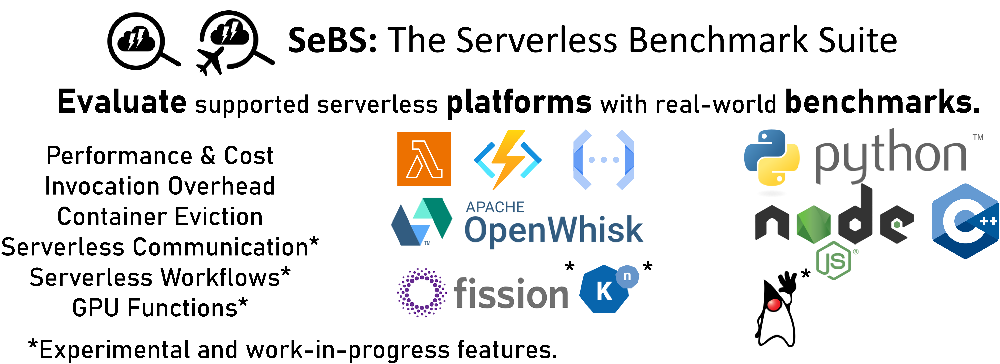

[](https://circleci.com/gh/spcl/serverless-benchmarks)


# SeBS: Serverless Benchmark Suite

**FaaS benchmarking suite for serverless functions with automatic build, deployment, and measurements.**



SeBS is a diverse suite of FaaS benchmarks that allows automatic performance analysis of
commercial and open-source serverless platforms. We provide a suite of
[benchmark applications](docs/benchmarks.md) and [experiments](docs/experiments.md)
and use them to test and evaluate different components of FaaS systems.
See the [installation instructions](#installation) to learn how to configure SeBS to use selected
commercial and open-source serverless systems.
Then, take a look at [usage instructions](docs/usage.md) to see how
SeBS can automatically launch serverless functions and entire experiments in the cloud!


SeBS provides support for **automatic deployment** and invocation of benchmarks on
commercial and black-box platforms
[AWS Lambda](https://aws.amazon.com/lambda/),
[Azure Functions](https://azure.microsoft.com/en-us/services/functions/),
and [Google Cloud Functions](https://cloud.google.com/functions).
Furthermore, we support the open-source platform [OpenWhisk](https://openwhisk.apache.org/)
and offer a custom, Docker-based local evaluation platform.
See the [documentation on cloud providers](docs/platforms.md)
for details on configuring each platform in SeBS.
The documentation describes in detail [the design and implementation of our
tool](docs/design.md), and see the [modularity](docs/modularity.md)
section to learn how SeBS can be extended with new platforms, benchmarks, and experiments.
Find out more about our project in [a paper summary](https://mcopik.github.io/projects/sebs/).

Do you have further questions not answered by our documentation?
Did you encounter troubles with installing and using SeBS?
Or do you want to use SeBS in your work and you need new features?
Feel free to reach us through GitHub issues or by writing to <marcin.copik@inf.ethz.ch>.


For more information on how to configure, use, and extend SeBS, see our
documentation:

* [How to use SeBS?](docs/usage.md)
* [Which benchmark applications are offered?](docs/benchmarks.md)
* [Which experiments can be launched to evaluate FaaS platforms?](docs/experiments.md)
* [How to configure serverless platforms?](docs/platforms.md)
* [How SeBS builds and deploys functions?](docs/build.md)
* [How SeBS package is designed?](docs/design.md)
* [How to extend SeBS with new benchmarks, experiments, and platforms?](docs/modularity.md)

### Publication

When using SeBS, please cite our [Middleware '21 paper](https://dl.acm.org/doi/abs/10.1145/3464298.3476133).
An extended version of our paper is [available on arXiv](https://arxiv.org/abs/2012.14132), and you can
find more details about research work [in this paper summary](https://mcopik.github.io/projects/sebs/).
You can cite our software repository as well, using the citation button on the right.

```
@inproceedings{copik2021sebs,
  author = {Copik, Marcin and Kwasniewski, Grzegorz and Besta, Maciej and Podstawski, Michal and Hoefler, Torsten},
  title = {SeBS: A Serverless Benchmark Suite for Function-as-a-Service Computing},
  year = {2021},
  isbn = {9781450385343},
  publisher = {Association for Computing Machinery},
  address = {New York, NY, USA},
  url = {https://doi.org/10.1145/3464298.3476133},
  doi = {10.1145/3464298.3476133},
  booktitle = {Proceedings of the 22nd International Middleware Conference},
  pages = {64–78},
  numpages = {15},
  keywords = {benchmark, serverless, FaaS, function-as-a-service},
  location = {Qu\'{e}bec city, Canada},
  series = {Middleware '21}
}
```

## Installation

Requirements:
- Docker (at least 19)
- Python 3.7+ with:
    - pip
    - venv
- `libcurl` and its headers must be available on your system to install `pycurl`
- Standard Linux tools and `zip` installed

... and that should be all. We currently support Linux and other POSIX systems with Bash available.
On Windows, we recommend using WSL.

To install the benchmarks with a support for all platforms, use:

```
./install.py --aws --azure --gcp --openwhisk --local
```

It will create a virtual environment in `python-venv`, and install necessary Python
dependencies and third-party dependencies. To use SeBS, you must first active the new Python
virtual environment:

```
. python-venv/bin/activate
```

Now you can deploy serverless experiments :-)

The installation of additional platforms is controlled with the `--{platform}` and `--no-{platform}`
switches. Currently, the default behavior for `install.py` is to install only the
local environment.

To verify the correctness of installation, you can use [our regression testing](docs/usage.md#regression).

> **Warning**
> We use libcurl to make HTTP requests. `pycurl` will attempt to build its bindings and needs headers for that - make sure you have all development packages installed. If you see an error like this one: `src/pycurl.h:206:13: fatal error: gnutls/gnutls.h: No such file or directory`, it means that you are missing some of the dependencies.

> **Warning**
> **Make sure** that your Docker daemon is running and your user has sufficient permissions to use it. Otherwise, you might see many "Connection refused" and "Permission denied" errors when using SeBS.

## Authors

* [Marcin Copik (ETH Zurich)](https://github.com/mcopik/) - main author.
* [Michał Podstawski (Future Processing SA)](https://github.com/micpod/) - contributed graph and DNA benchmarks, and worked on Google Cloud support.
* [Laurin Brandner (ETH Zurich)](https://github.com/lbrndnr) - contributed serverless workflows.
* [Nico Graf (ETH Zurich)](https://github.com/ncograf/) - contributed to the implementation of regression tests and bugfixes and helped with testing and documentation.
* [Kacper Janda](https://github.com/Kacpro), [Mateusz Knapik](https://github.com/maknapik), [JmmCz](https://github.com/JmmCz), AGH University of Science and Technology - contributed together Google Cloud support.
* [Grzegorz Kwaśniewski (ETH Zurich)](https://github.com/gkwasniewski) - worked on the modeling experiments.
* [Paweł Żuk (University of Warsaw)](https://github.com/pmzuk) - contributed OpenWhisk support.
* [Sascha Kehrli (ETH Zurich)](https://github.com/skehrli) - contributed local measurement of Docker containers.
* [Kaleab](https://github.com/Kaleab-git) - contributed to SeBS local backend to make it portable between platforms and more robust on non-Linux systems.
* [lawrence910426](https://github.com/lawrence910426) - contributed color-coded output to SeBS CLI.
