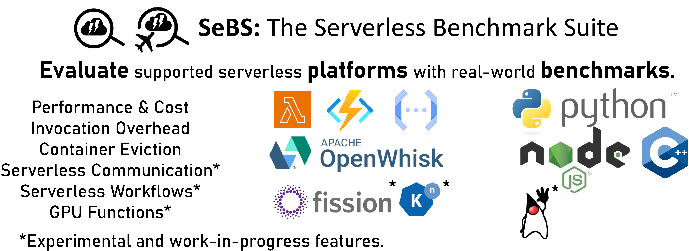

[](https://circleci.com/gh/spcl/serverless-benchmarks)
[](https://sebs.readthedocs.io/en/latest/?badge=latest)


[](https://join.slack.com/t/serverlessbenchmark/shared_invite/zt-30622ov74-_S9QeDjAJLZSe9bJC8tStw)

# SeBS: Serverless Benchmark Suite

**FaaS benchmarking suite for serverless functions with automatic build, deployment, and measurements.**



SeBS is a diverse suite of FaaS benchmarks that allows automatic performance analysis of
commercial and open-source serverless platforms. We provide a suite of
[benchmark applications](docs/benchmarks.md) in Python, Node.js, Java, and C++ covering workloads from web applications to scientific computing.
With automtic [experiments](docs/experiments.md), we test and evaluate different components of FaaS systems.
SeBS provides support for **automatic deployment** and invocation of benchmarks on
commercial and black-box platforms
[AWS Lambda](https://aws.amazon.com/lambda/),
[Azure Functions](https://azure.microsoft.com/en-us/services/functions/),
and [Google Cloud Functions](https://cloud.google.com/functions).
Furthermore, we support the open-source platform [OpenWhisk](https://openwhisk.apache.org/)
and offer a custom, Docker-based local evaluation platform.

## How can SeBS help you?

* Are you looking for an experimentation platform to test and analyze the performance of serverless across cloud platforms?
* Do you need a set of standardized benchmarks for your serverless experiments and research work?
* Do you want a fully automated pipeline for build, deployment, and measurements, with no manual effort?

Then SeBS might just be the tool for you and your work!

See the [installation instructions](#installation) and [SeBS tutorial](#tutorial) below to learn how to configure SeBS to use selected commercial and open-source serverless systems.
Then, take a look at our documentation to see how SeBS can automatically launch serverless functions and entire experiments in the cloud!
You can also find details about SeBS design and experimental results in [our peer-reviewed publications](#publications).

* [Getting started: how to use SeBS?](docs/usage.md)
* [Getting started: how to configure cloud and serverless platforms?](docs/platforms.md)
* [Going deeper: which benchmark applications are offered?](docs/benchmarks.md)
* [Going deeper: which experiments can be launched to evaluate FaaS platforms?](docs/experiments.md)
* [Internals: how SeBS builds and deploys functions?](docs/build.md)
* [Internals: how SeBS package is designed?](docs/design.md)
* [Modularity: how to extend SeBS with new benchmarks, experiments, and platforms?](docs/modularity.md)

Do you have further questions that were not answered by our documentation?
Did you encounter trouble installing and using SeBS?
Or do you want to use SeBS in your work and you need new features?
[Join our community on Slack](https://join.slack.com/t/serverlessbenchmark/shared_invite/zt-30622ov74-_S9QeDjAJLZSe9bJC8tStw) or open a GitHub issue.


## Installation

Requirements:
- Docker (at least 19)
- Python 3.10+ with `pip` + `venv` or `uv`
- `libcurl` and its headers must be available on your system to install `pycurl`
- Standard Linux tools and `zip` installed

... and that should be all. We currently support Linux and other POSIX systems with Bash available. On Windows, we recommend using WSL.

> [!WARNING]
> Please do not use SeBS with `sudo`. There is no requirement to use any superuser permissions. **Make sure** that your Docker daemon is running and your user has sufficient permissions to use it (see [Docker documentation](https://docs.docker.com/engine/install/linux-postinstall/) on configuring your user to have non-sudo access to containers). Otherwise, you might see many "Connection refused" and "Permission denied" errors when using SeBS.

SeBS can be installed in one of three ways:

### 1. Package Install (Recommended for Users)

Install SeBS directly from PyPI with your favorite tools:

```bash
pip install serverless-benchmarks
sebs --help

uv pip install serverless-benchmarks
uv run sebs --help
```

Now you can deploy serverless experiments :-) Benchmarks data will be automatically cloned to `~/.sebs/benchmarks-data/` on first benchmark use.

To verify the correctness of installation, you can use [our regression testing](docs/usage.md#regression).

### 2. Git Install (For Contributors)

For developers who want to modify SeBS or contribute to the project:

```bash
git clone https://github.com/spcl/serverless-benchmarks.git
cd serverless-benchmarks
# -e for editable install, i.e, changes are immediately visible in the package
# [dev] adds developer dependencies, e.g., for code linting
pip install -e '.[dev]'
sebs --help

# alternative
uv sync --extra dev
uv run sebs --help
```

### 3. Legacy Development Install

This method is deprecated and will be removed in future releases. It is recommended to use the Git Install method instead.

```bash
git clone https://github.com/spcl/serverless-benchmarks.git
cd serverless-benchmarks
./install.py --aws --azure --gcp --openwhisk --local
```

This will create a virtual environment in `python-venv`, and install necessary Python
dependencies and third-party dependencies. To use SeBS, you must first activate the new Python virtual environment:

```bash
. python-venv/bin/activate
python -m sebs.cli --help
```

The installation of additional platforms is controlled with the `--{platform}` and `--no-{platform}` switches. Currently, the default behavior for `install.py` is to install only the local environment.

## Tutorial

We provide a tutorial on basic SeBS functionality in the [SeBS-Tutorial repository](https://github.com/spcl/sebs-tutorial.git).
You can learn there how to install SeBS, configure it, deploy OpenWhisk on your system, and launch your first experiments.

## Publications

When using SeBS, please cite our published work.
You can cite our software repository as well, using the citation button on the right.

SeBS has been originally released with the [Middleware '21 paper](https://dl.acm.org/doi/abs/10.1145/3464298.3476133).
An extended version of our paper is [available on arXiv](https://arxiv.org/abs/2012.14132), and you can
find more details about our research work [in this paper summary](https://mcopik.github.io/projects/sebs/).

```
@inproceedings{copik2021sebs,
  author = {Copik, Marcin and Kwasniewski, Grzegorz and Besta, Maciej and Podstawski, Michal and Hoefler, Torsten},
  title = {SeBS: A Serverless Benchmark Suite for Function-as-a-Service Computing},
  year = {2021},
  isbn = {9781450385343},
  publisher = {Association for Computing Machinery},
  address = {New York, NY, USA},
  url = {https://doi.org/10.1145/3464298.3476133},
  doi = {10.1145/3464298.3476133},
  booktitle = {Proceedings of the 22nd International Middleware Conference},
  pages = {64–78},
  numpages = {15},
  keywords = {benchmark, serverless, FaaS, function-as-a-service},
  location = {Qu\'{e}bec city, Canada},
  series = {Middleware '21}
}
```

The SeBS-Flow paper published at [EuroSys'25](https://dl.acm.org/doi/abs/10.1145/3689031.3717465)
extends SeBS with support for serverless workflows and NoSQL database.
You can find workflow benchmarks on the [`feature/workflows`](https://github.com/spcl/serverless-benchmarks/tree/feature/workflows) branch   (AWS, Azure, GCP).

<details>
<summary>BibTeX citation for the SeBS-Flow paper.</summary>
    
```
@inproceedings{10.1145/3689031.3717465,
  author = {Schmid, Larissa and Copik, Marcin and Calotoiu, Alexandru and Brandner, Laurin and Koziolek, Anne and Hoefler, Torsten},
  title = {SeBS-Flow: Benchmarking Serverless Cloud Function Workflows},
  year = {2025},
  isbn = {9798400711961},
  publisher = {Association for Computing Machinery},
  address = {New York, NY, USA},
  url = {https://doi.org/10.1145/3689031.3717465},
  doi = {10.1145/3689031.3717465},
  booktitle = {Proceedings of the Twentieth European Conference on Computer Systems},
  pages = {902–920},
  numpages = {19},
  keywords = {benchmark, faas, function-as-a-service, orchestration, serverless, serverless DAG, workflow},
  location = {Rotterdam, Netherlands},
  series = {EuroSys '25}
}
```
    
</details>

The SeBS 2.0 workshop paper published at [SESAME @ EuroSys'25](https://dl.acm.org/doi/abs/10.1145/3721465.3721867)
provides an overview of new and ongoing contributions to SeBS - benchmarks, platforms, languages.

<details>
<summary>BibTeX citation for the SeBS 2.0 paper.</summary>

```
@inproceedings{10.1145/3721465.3721867,
  author = {Copik, Marcin and Calotoiu, Alexandru and Hoefler, Torsten},
  title = {SeBS 2.0: Keeping up with the Clouds},
  year = {2025},
  isbn = {9798400715570},
  publisher = {Association for Computing Machinery},
  address = {New York, NY, USA},
  url = {https://doi.org/10.1145/3721465.3721867},
  doi = {10.1145/3721465.3721867},
  booktitle = {Proceedings of the 3rd Workshop on SErverless Systems, Applications and MEthodologies},
  pages = {42–44},
  numpages = {3},
  keywords = {Benchmark, FaaS, Function-as-a-Service, Serverless},
  location = {Rotterdam, Netherlands},
  series = {SESAME' 25}
}
```

</details>

## Development

We welcome new contributions! When extending SeBS, please check first [contributor guidelines](docs/contributing.md) to learn the expected code style.
Please feel free to get in touch with us - we are happy to provide guidance and help you to implement new features in SeBS.

### Feature Branches

We provide several experimental features that have not yet been merged into the main branch. You can use them to get early access to upcoming benchmarks, platforms, and experiments.
However, they can be missing some of the features from the `master` branch.

* [`feature/workflows`](https://github.com/spcl/serverless-benchmarks/tree/feature/workflows) with serverless workflows benchmarks (AWS, Azure, GCP).
* [`feature_fission`](https://github.com/spcl/serverless-benchmarks/tree/feature_fission) with support for Fission platform.
* [`oanarosca/triggers`](https://github.com/spcl/serverless-benchmarks/tree/oanarosca/triggers) with queue and storage triggers (AWS, Azure, GCP).

## Authors & Contributors

* [Marcin Copik (ETH Zurich)](https://github.com/mcopik/) - main author.
* [Michał Podstawski (Future Processing SA)](https://github.com/micpod/) - contributed graph and DNA benchmarks, and worked on Google Cloud support.
* [Laurin Brandner (ETH Zurich)](https://github.com/lbrndnr) - contributed serverless workflows.
* [Nico Graf (ETH Zurich)](https://github.com/ncograf/) - contributed to the implementation of regression tests and bugfixes and helped with testing and documentation.
* [Kacper Janda](https://github.com/Kacpro), [Mateusz Knapik](https://github.com/maknapik), [JmmCz](https://github.com/JmmCz), AGH University of Science and Technology - contributed together Google Cloud support.
* [Grzegorz Kwaśniewski (ETH Zurich)](https://github.com/gkwasniewski) - worked on the modeling experiments.
* [Paweł Żuk (University of Warsaw)](https://github.com/pmzuk) - contributed OpenWhisk support.
* [Sascha Kehrli (ETH Zurich)](https://github.com/skehrli) - contributed local measurement of Docker containers.
* [Kaleab](https://github.com/Kaleab-git) - contributed to SeBS local backend to make it portable between platforms and more robust on non-Linux systems.
* [lawrence910426](https://github.com/lawrence910426) - contributed color-coded output to SeBS CLI.
* [Abhishek Kumar](https://github.com/octonawish-akcodes) - contributed new language versions and Knative support.
* [Prajin Khadka](https://github.com/prajinkhadka) - contributed new language versions, container support, and ARM builds.
* [Horia Mercan](https://github.com/HoriaMercan) - contributed new benchmarks in C++.
* [Dillon Elste (ETH Zurich)](https://github.com/DJAntivenom) - bugfixing in C++.
* [Mahla Sharifi](https://github.com/mahlashrifi) - contributed support for Java benchmarks.
* [Alexander Schlieper (ETH Zurich)](https://github.com/xSurus) - improved support for Java benchmarks.
