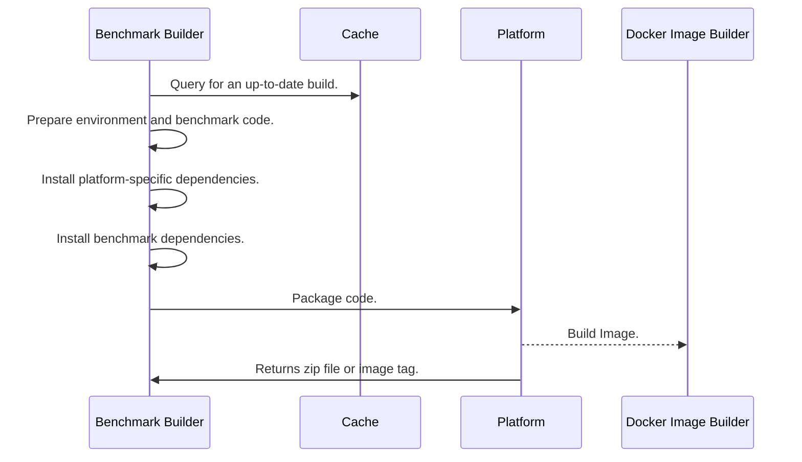

SeBS caches built code packages to save time, as installing dependencies can be time and bandwidth consuming, e.g., for ML frameworks such as PyTorch.
Furthermore, some benchmarks require special treatment - for example, PyTorch image recognition benchmark requires additinal stripping and compression steps to fit into the size limits of AWS Lambda code package.

By default, we deploy benchmark code as package uploaded to the serverless platform.
However, on some platforms we use [Docker images](#docker-image-build) instead.

## Code Package Build

**Query Cache** - first, we check if there is an up-to-date build of the benchmark function
that can be used.

**Prepare Environment** - benchmark code with data is copied to the build location.

**Add Benchmark Data** - optional step of adding additional, external dependencies. An example is downloading `ffmpeg` release into `220.video-processing` benchmark.

**Add Platform-Specific Wrappers** - we add lightweight shims to implement the cloud-specific API and keep benchmark applications generic and portable.

**Add Deployment Packages** - some platforms require installing specific dependencies, such as cloud storage SDKs in Azure and Google Cloud, as well as the Minio SDK for OpenWhisk.

**Install Dependencies** - in this step, we use the Docker builder container.
We mount the working copy as a volume in the container, and execute there 
This step is skipped for OpenWhisk.

**Package Code** - we move files to create the directory structure expected on each cloud platform and
create a final deployment package. An example of a customization is Azure Functions, where additional
JSON configuration files are needed.

**Build Docker Image** - in this step, we create a new image `function.{platform}.{benchmark}.{language}-{version}`.
Benchmark and all of its dependencies are installed there, and the image can be deployed directly
to the serverless platform. At the moment, this step is used only in OpenWhisk.

## Docker Image Build

A different approach is taken in OpenWhisk.
Since OpenWhisk has a very small size limit on code packages, we deploy all functions as Docker images.
There, in this step, we copy the prepared benchmark code into a newly created Docker image where 
all dependencies are installed. The image is later pushed to either DockerHub or a user-defined registry.

In future, we plan to extend Docker image support to other platforms as well.

