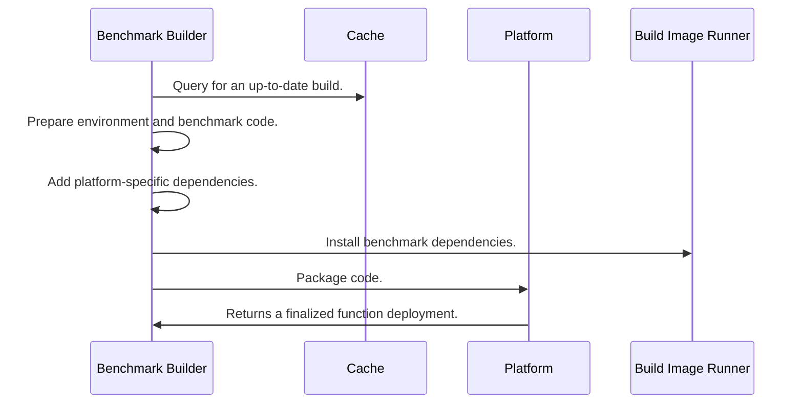
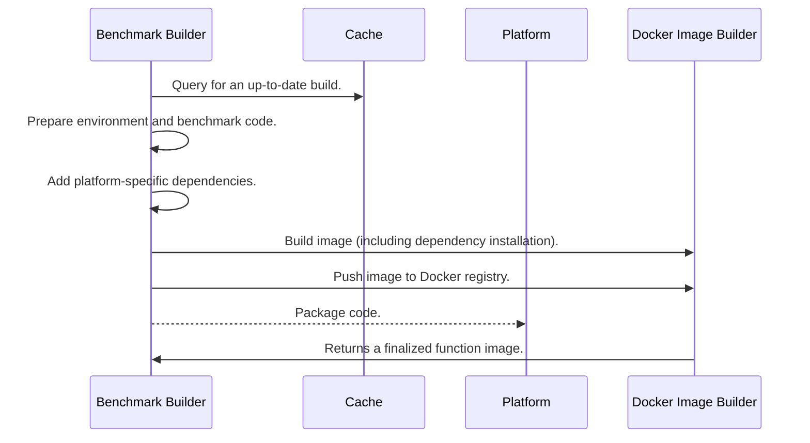

# Build and Deployment

SeBS caches built code packages to save time, as installing dependencies can be time and bandwidth-consuming, e.g., for ML frameworks such as PyTorch.
Furthermore, some benchmarks require special treatment - for example, the PyTorch image recognition benchmark requires additional stripping and compression steps to fit into the size limits of AWS Lambda code package.

By default, we deploy benchmark code as a package uploaded to the serverless platform. There, we use custom **build images** to install dependencies in an environment resembling the
function executor in the cloud. However, on some platforms, we deploy functions as [Docker images](#docker-image-deployment) instead. There, we create one **function image** for each benchmark and configuration (language, language version, architecture).

## Code Package Deployment

```mermaid
sequenceDiagram
    participant Benchmark Builder
    participant Cache
    participant Platform
    participant Build Image Runner
    Benchmark Builder->>Cache: Query for an up-to-date build.
    Benchmark Builder->>Benchmark Builder: Prepare environment and benchmark code.
    Benchmark Builder->>Benchmark Builder: Add platform-specific dependencies.
    Benchmark Builder->>Build Image Runner: Install benchmark dependencies.
    Benchmark Builder->>Platform: Package code.
    Platform->>Benchmark Builder: Returns a finalized function deployment.
```

**Query Cache** - first, we check if there is an up-to-date build of the benchmark function that can be used. If there is no cached package, or the function code has been changed, we need to build a new deployment package.

**Prepare Environment** - benchmark code with data is copied to the build location.

**Add Benchmark Data** - optional step of adding additional, external dependencies. An example is downloading `ffmpeg` release into `220.video-processing` benchmark.

**Add Platform-Specific Wrappers** - we add lightweight shims to implement the cloud-specific API and keep benchmark applications generic and portable.

**Add Deployment Packages** - some platforms require installing specific dependencies, such as cloud storage SDKs in Azure and Google Cloud, as well as the Minio SDK for OpenWhisk. We extend function configuration to add those packages, as they will be installed in the next step. In C++, we generate a customized CMake configuration that includes all packages required by the function, e.g., OpenCV or Torch. Each function defines its **modules** that need to be added, such as `storage` for object storage
and `nosql` for NoSQL databases. Each module corresponds to a set of packages that need to be installed for the function to work on a specific platform.

**Install Dependencies** - in this step, we use the Docker builder container. We mount the working copy as a volume in the container, and install dependencies inside it. In C++, we perform the CMake configuration and build steps here.

**Package Code** - we move files to create the directory structure expected on each cloud platform and create a final deployment package. An example of a customization is Azure Functions, where additional
JSON configuration files are needed.

## Docker Image Deployment

```mermaid
sequenceDiagram
    participant Benchmark Builder
    participant Cache
    participant Platform
    participant Docker Image Builder
    Benchmark Builder->>Cache: Query for an up-to-date build.
    Benchmark Builder->>Benchmark Builder: Prepare environment and benchmark code.
    Benchmark Builder->>Benchmark Builder: Add platform-specific dependencies.
    Benchmark Builder->>Docker Image Builder: Build image (including dependency installation).
    Benchmark Builder->>Docker Image Builder: Push image to Docker registry.
    Benchmark Builder-->>Platform: Package code.
    Docker Image Builder->>Benchmark Builder: Returns a finalized function image.
```

An alternative to uploading a code package is to deploy a Docker image. This option is not supported on all platforms; for example, Azure Functions and Google Cloud Functions do not support custom Docker images. Compared to code package deployment, we have two new steps and one step is modified:

**Build Docker Image** - in this step, we create a new image `function.{platform}.{benchmark}.{language}-{version}-{architecture}-{sebs-version}`.
Benchmark and all of its dependencies are installed there, and the image can be deployed directly to the serverless platform. 

**Push Docker Image** - the image is pushed to a Docker registry. On AWS, we use AWS ECR. For OpenWhisk, we use DockerHub but also support
pushing images to a custom registry. For example, a local registry deployment can be preferred since pushing and pulling images is much faster.

**Package Code** - while this step is mandatory for a code package, it is rarely needed when building a Docker image. However, it might be necessary on some platforms (see OpenWhisk details below).

### AWS Lambda

We support deploying functions as Docker images for Python, Node.js, and C++ functions. We also support building arm64 images for this platform, except for C++ functions (extension to ARM functions is planned in the future).

### OpenWhisk

This platform has a very small size limit on code packages. Thus, we deploy all functions as Docker images.
In this step, we copy the prepared benchmark code into a newly created Docker image where 
all dependencies are installed. The image is later pushed to either DockerHub or a user-defined registry.
However, we still create a small zip package containing only the main handler; it is not possible to create an OpenWhisk action directly from a Docker image.

