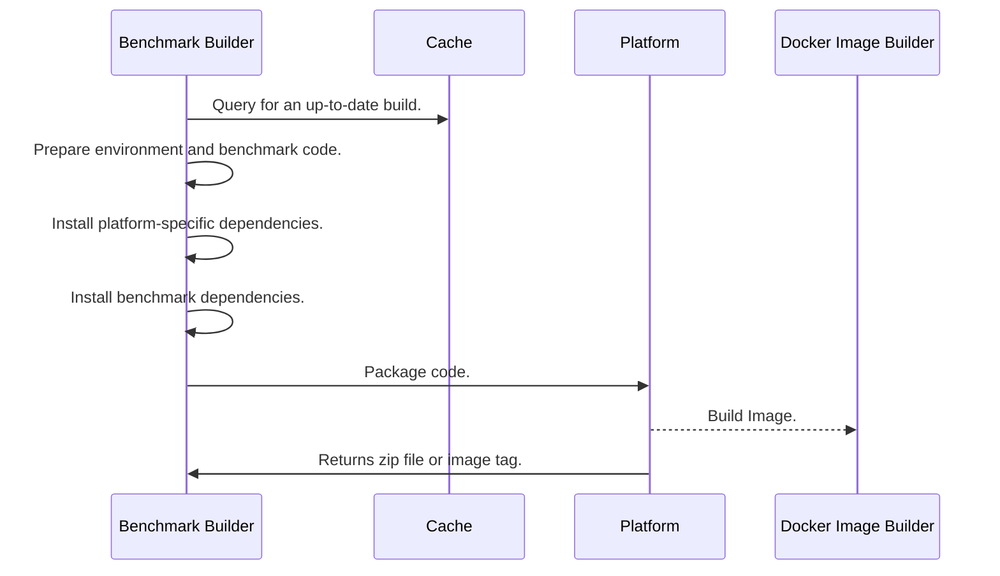

SeBS caches built code packages to save time, as installing dependencies can be time and bandwidth consuming, e.g., for ML frameworks such as PyTorch.
Furthermore, some benchmarks require special treatment - for example, PyTorch image recognition benchmark requires additinal stripping and compression steps to fit into the size limits of AWS Lambda code package.

By default, we deploy benchmark code as package uploaded to the serverless platform.
However, on some platforms we use [Docker images](#docker-image-build) instead.


```mermaid
sequenceDiagram
    participant Benchmark Builder
    participant Cache
    participant Platform
    participant Docker Image Builder
    Benchmark Builder->>Cache: Query for an up-to-date build.
    Benchmark Builder->>Benchmark Builder: Prepare environment and benchmark code.
    Benchmark Builder->>Benchmark Builder: Install platform-specific dependencies.
    Benchmark Builder->>Benchmark Builder: Install benchmark dependencies.
    Benchmark Builder->>Platform: Package code.
    Platform-->>Docker Image Builder: Build Image.
    Platform->>Benchmark Builder: Returns zip file or image tag.
```
## Code Package Build

**Query Cache** - first, we check if there is an up-to-date build of the benchmark function
that can be used.

**Prepare Environment** - benchmark code with data is copied to the build location.

**Add Benchmark Data** - optional step of adding additional, external dependencies. An example is downloading `ffmpeg` release into `220.video-processing` benchmark.

**Add Platform-Specific Wrappers** - we add lightweight shims to implement the cloud-specific API and keep benchmark applications generic and portable.

**Add Deployment Packages** - some platforms require installing specific dependencies, such as cloud storage SDKs in Azure and Google Cloud, as well as the Minio SDK for OpenWhisk.

**Install Dependencies** - in this step, we use the Docker builder container.
We mount the working copy as a volume in the container, and execute there 
This step is skipped for OpenWhisk.

**Package Code** - we move files to create the directory structure expected on each cloud platform and
create a final deployment package. An example of a customization is Azure Functions, where additional
JSON configuration files are needed.

**Build Docker Image** - in this step, we create a new image `function.{platform}.{benchmark}.{language}-{version}`.
Benchmark and all of its dependencies are installed there, and the image can be deployed directly
to the serverless platform. At the moment, this step is used only on AWS and in OpenWhisk.

## Docker Image Build

A different approach is taken in OpenWhisk.
Since OpenWhisk has a very small size limit on code packages, we deploy all functions as Docker images.
There, in this step, we copy the prepared benchmark code into a newly created Docker image where 
all dependencies are installed. The image is later pushed to either DockerHub or a user-defined registry.

In future, we plan to extend Docker image support to other platforms as well.

## Language Variants

SeBS supports **language variants** — alternative runtimes or engines for the same language.
Examples include `bun` and `llrt` for Node.js, and `pypy` for Python.
Each variant runs the same benchmark source code (or a lightly adapted version of it) inside a
different runtime environment, enabling direct performance comparisons between runtimes.

A variant always has a corresponding **runtime Docker image** and, optionally, adapted benchmark
source code.  The default execution (no variant) is always built; variant images and code are
additive on top of it.

---

### 1. Declaring variants in a benchmark (`config.json`)

A benchmark opts into variant support by using the extended language object syntax in its
`config.json`.  The legacy string form (`"python"`) implies only the `"default"` variant.

```json
{
  "timeout": 10,
  "memory": 128,
  "languages": [
    { "language": "nodejs", "variants": ["default", "bun", "llrt"] },
    { "language": "python", "variants": ["default", "pypy"] }
  ],
  "modules": []
}
```

SeBS validates this at startup: if you request a variant that is not listed here, the run is
rejected with an error.

---

### 2. Variant source code inside a benchmark

Variant-specific source files live in a sub-directory named after the variant, inside the
language directory of the benchmark:

```
benchmarks/<id>/<language>/<variant>/
```

Two strategies are supported:

#### Patch variant (small targeted changes)

Place a unified diff file named `patch.diff` inside the variant directory.
The patch is applied on top of the already-copied default source files.

```
benchmarks/100.webapps/110.dynamic-html/
  nodejs/
    function.js          ← default implementation
    package.json
    llrt/
      patch.diff         ← unified diff applied over the default files
```

Use this when the variant only needs minor adjustments to the default code (e.g. replacing an
async API with a sync one because the alternative runtime lacks full async support, or swapping
one import for a built-in equivalent).

#### Overlay variant (full rewrite)

If the variant directory contains source files (`.py` / `.js`, `requirements.txt`,
`package.json`, …) but **no** `patch.diff`, all those files are copied on top of the default
files, replacing them completely.

```
benchmarks/100.webapps/110.dynamic-html/
  nodejs/
    function.js               ← default implementation
    package.json
    bun/
      package.json            ← replaces the default package.json for bun
```

Use this when the variant needs a substantially different implementation (e.g. a complete
rewrite using runtime-specific APIs).

> **Version-specific `package.json` for Node.js** — a file named
> `package.json.<version>` (e.g. `package.json.18`) inside the variant directory overrides the
> generic `package.json` for that specific Node.js/runtime version only.

If neither `patch.diff` nor any source files exist in the variant directory, the default
sources are used unchanged (the variant differs only in its runtime Docker image).

---

### 3. Registering variants in `config/systems.json`

Each deployment system declares which variant images it provides via the `variant_images` list
under the language entry:

```json
"nodejs": {
  "base_images": { "x64": { "18": "node:18-slim", ... }, ... },
  "images": ["run", "build"],
  "variant_images": ["bun", "llrt"]
},
"python": {
  "base_images": { ... },
  "images": ["run", "build"],
  "variant_images": ["pypy"]
}
```

A variant listed here must have a corresponding `Dockerfile.run` (see next section) and will be
built automatically when `build_docker_images.py` is invoked without `--language-variant`.

---

### 4. Variant Docker images

Each variant needs its own run-time Docker image stored at:

```
dockerfiles/<system>/<language>/<variant>/Dockerfile.run
```

For example:

```
dockerfiles/local/nodejs/bun/Dockerfile.run
dockerfiles/local/nodejs/llrt/Dockerfile.run
dockerfiles/local/python/pypy/Dockerfile.run
```

The resulting image is tagged:

```
<docker_repository>:run.<system>.<language>.<variant>.<version>-<SeBS_version>
```

e.g. `spcleth/serverless-benchmarks:run.local.nodejs.bun.18-1.2.0`.

To build all variant images for a system:

```bash
python tools/build_docker_images.py --deployment local
```

To build a single variant only:

```bash
python tools/build_docker_images.py --deployment local --language nodejs --language-variant bun
```

---

### 5. Cache isolation

Each variant gets its own cache entry.  The cache key for a non-default variant is
`<language>_<variant>` (e.g. `nodejs_bun`), so default and variant builds never collide.
The cache hash includes either the `patch.diff` or all overlay source files, so any change to
the variant code invalidates the cached package automatically.

---

### Summary: checklist for adding a new variant

| Step | What to do |
|------|-----------|
| **Declare in benchmark** | Add the variant name to `"variants"` in `config.json` for each benchmark that supports it. |
| **Add source code** (if needed) | Create `benchmarks/<id>/<lang>/<variant>/patch.diff` (patch variant) *or* place replacement source files there (overlay variant). |
| **Add Dockerfile** | Create `dockerfiles/<system>/<lang>/<variant>/Dockerfile.run`. |
| **Register in systems.json** | Add the variant name to `variant_images` for the appropriate language and system. |
| **Build image** | Run `python tools/build_docker_images.py --deployment <system> --language <lang> --language-variant <variant>`. |

