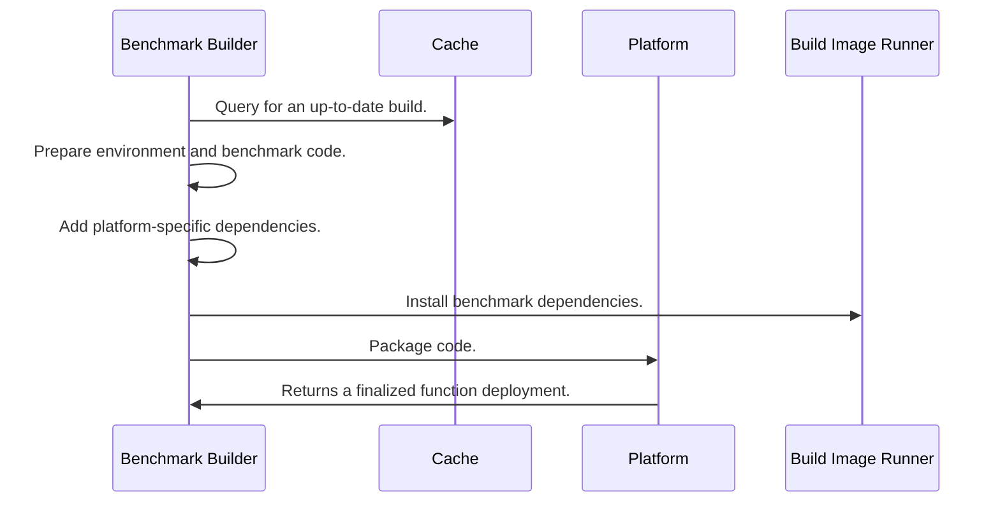
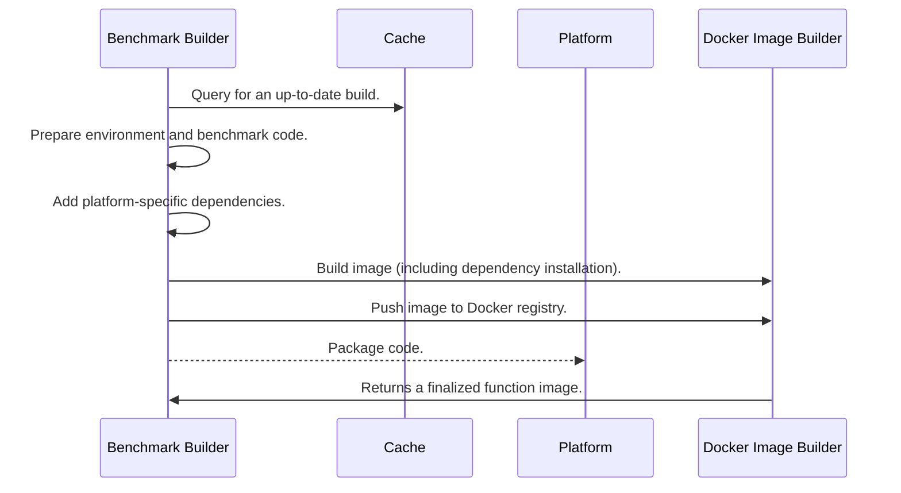

# Build and Deployment

SeBS caches built code packages to save time, as installing dependencies can be time and bandwidth-consuming, e.g., for ML frameworks such as PyTorch.
Furthermore, some benchmarks require special treatment - for example, the PyTorch image recognition benchmark requires additional stripping and compression steps to fit into the size limits of AWS Lambda code package.

By default, we deploy benchmark code as a package uploaded to the serverless platform. There, we use custom **build images** to install dependencies in an environment resembling the
function executor in the cloud. However, on some platforms, we deploy functions as [Docker images](#docker-image-deployment) instead. There, we create one **function image** for each benchmark and configuration (language, language version, architecture).

## Code Package Deployment


```mermaid
sequenceDiagram
    participant Benchmark Builder
    participant Cache
    participant Platform
    participant Build Image Runner
    Benchmark Builder->>Cache: Query for an up-to-date build.
    Benchmark Builder->>Benchmark Builder: Prepare environment and benchmark code.
    Benchmark Builder->>Benchmark Builder: Add platform-specific dependencies.
    Benchmark Builder->>Build Image Runner: Install benchmark dependencies.
    Benchmark Builder->>Platform: Package code.
    Platform->>Benchmark Builder: Returns a finalized function deployment.
```

**Query Cache** - first, we check if there is an up-to-date build of the benchmark function that can be used. If there is no cached package, or the function code has been changed, we need to build a new deployment package.

**Prepare Environment** - benchmark code with data is copied to the build location.

**Add Benchmark Data** - optional step of adding additional, external dependencies. An example is downloading `ffmpeg` release into `220.video-processing` benchmark.

**Add Platform-Specific Wrappers** - we add lightweight shims to implement the cloud-specific API and keep benchmark applications generic and portable.

**Add Deployment Packages** - some platforms require installing specific dependencies, such as cloud storage SDKs in Azure and Google Cloud, as well as the Minio SDK for OpenWhisk. We extend function configuration to add those packages, as they will be installed in the next step. In C++, we generate a customized CMake configuration that includes all packages required by the function, e.g., OpenCV or Torch. Each function defines its **modules** that need to be added, such as `storage` for object storage
and `nosql` for NoSQL databases. Each module corresponds to a set of packages that need to be installed for the function to work on a specific platform.

**Install Dependencies** - in this step, we use the Docker builder container. We mount the working copy as a volume in the container, and install dependencies inside it. In C++, we perform the CMake configuration and build steps here.

**Package Code** - we move files to create the directory structure expected on each cloud platform and create a final deployment package. An example of a customization is Azure Functions, where additional
JSON configuration files are needed.

## Docker Image Deployment


```mermaid
sequenceDiagram
    participant Benchmark Builder
    participant Cache
    participant Platform
    participant Docker Image Builder
    Benchmark Builder->>Cache: Query for an up-to-date build.
    Benchmark Builder->>Benchmark Builder: Prepare environment and benchmark code.
    Benchmark Builder->>Benchmark Builder: Add platform-specific dependencies.
    Benchmark Builder->>Docker Image Builder: Build image (including dependency installation).
    Benchmark Builder->>Docker Image Builder: Push image to Docker registry.
    Benchmark Builder-->>Platform: Package code.
    Docker Image Builder->>Benchmark Builder: Returns a finalized function image.
```

An alternative to uploading a code package is to deploy a Docker image. This option is not supported on all platforms; for example, Azure Functions and Google Cloud Functions do not support custom Docker images. Compared to code package deployment, we have two new steps and one step is modified:

**Build Docker Image** - in this step, we create a new image `function.{platform}.{benchmark}.{language}-{version}-{architecture}-{sebs-version}`.
Benchmark and all of its dependencies are installed there, and the image can be deployed directly to the serverless platform. 

**Push Docker Image** - the image is pushed to a Docker registry. On AWS, we use AWS ECR. For OpenWhisk, we use DockerHub but also support
pushing images to a custom registry. For example, a local registry deployment can be preferred since pushing and pulling images is much faster.

**Package Code** - while this step is mandatory for a code package, it is rarely needed when building a Docker image. However, it might be necessary on some platforms (see OpenWhisk details below).

### AWS Lambda

We support deploying functions as Docker images for Python, Node.js, and C++ functions. We also support building arm64 images for this platform, except for C++ functions (extension to ARM functions is planned in the future).

### OpenWhisk

This platform has a very small size limit on code packages. Thus, we deploy all functions as Docker images.
In this step, we copy the prepared benchmark code into a newly created Docker image where 
all dependencies are installed. The image is later pushed to either DockerHub or a user-defined registry.
However, we still create a small zip package containing only the main handler; it is not possible to create an OpenWhisk action directly from a Docker image.

## Language Variants

SeBS supports **language variants** — alternative runtimes or engines for the same language.
Examples include `bun` and `llrt` for Node.js, and `pypy` for Python.
Each variant runs the same benchmark source code (or a lightly adapted version of it) inside a
different runtime environment, enabling direct performance comparisons between runtimes.

A variant always has a corresponding **runtime Docker image** and, optionally, adapted benchmark
source code.  The default execution (no variant) is always built; variant images and code are
additive on top of it.

---

### 1. Declaring variants in a benchmark (`config.json`)

A benchmark opts into variant support by using the extended language object syntax in its
`config.json`.  The legacy string form (`"python"`) implies only the `"default"` variant
and should be kept for languages that have no variant-specific code or configuration.

```json
{
  "timeout": 10,
  "memory": 128,
  "languages": [
    "java",
    {
      "language": "nodejs",
      "variants": {
        "default": "default",
        "bun": "bun",
        "llrt": "llrt"
      }
    },
    {
      "language": "python",
      "variants": {
        "default": "default",
        "pypy": "pypy"
      }
    }
  ],
  "modules": []
}
```

The `variants` field is a **dict** mapping each variant name to the source overlay directory
to apply for that variant (see [section 2](#2-variant-source-code-inside-a-benchmark) below).
The special sentinel value `"default"` means *use the base language directory without any
overlay* — no files are copied from a sub-directory.

SeBS validates this at startup: if you request a variant that is not listed here, the run is
rejected with an error.

#### Deployment-mode-split variants

Some variants behave differently depending on whether the function is deployed as a **code
package** (workers) or as a **container image**.  For those cases the overlay directory can be
specified per deployment mode using a nested dict:

```json
{
  "language": "nodejs",
  "variants": {
    "default": "default",
    "cloudflare": {"workers": "cloudflare", "containers": "default"}
  }
}
```

The inner dict must use the keys `"workers"` and/or `"containers"`.  A missing key means the
variant is not supported in that deployment mode and SeBS will raise an error if it is
requested.  A value of `"default"` means no overlay is applied for that mode (the base
language files are used unchanged).

This is useful when a variant requires platform-specific source changes for one deployment
mode but can reuse the standard implementation for the other.  For example, the `cloudflare`
variant of benchmarks that target Cloudflare Workers uses a Pyodide-aware implementation for
the `workers` mode, but falls back to the standard CPython implementation (`"default"`) for
the `containers` mode.

---

### 2. Variant source code inside a benchmark

Variant-specific source files live in a sub-directory named after the variant, inside the
language directory of the benchmark:

```
benchmarks/<id>/<language>/<variant>/
```

The overlay directory name comes from the value in the `variants` dict (or the inner
`workers`/`containers` value for deployment-mode-split variants).  When that value is
`"default"`, no sub-directory is consulted and the base language files are used as-is.

Two strategies are supported for non-`"default"` overlay directories:

#### Patch variant (small targeted changes)

Place a unified diff file named `patch.diff` inside the variant directory.
The patch is applied on top of the already-copied default source files.

```
benchmarks/100.webapps/110.dynamic-html/
  nodejs/
    function.js          ← default implementation
    package.json
    llrt/
      patch.diff         ← unified diff applied over the default files
```

Use this when the variant only needs minor adjustments to the default code (e.g. replacing an
async API with a sync one because the alternative runtime lacks full async support, or swapping
one import for a built-in equivalent).

#### Overlay variant (full rewrite)

If the variant directory contains source files (`.py` / `.js`, `requirements.txt`,
`package.json`, …) but **no** `patch.diff`, all those files are copied on top of the default
files, replacing them completely.

```
benchmarks/100.webapps/110.dynamic-html/
  nodejs/
    function.js               ← default implementation
    package.json
    bun/
      package.json            ← replaces the default package.json for bun
```

Use this when the variant needs a substantially different implementation (e.g. a complete
rewrite using runtime-specific APIs).

> **Version-specific `package.json` for Node.js** — a file named
> `package.json.<version>` (e.g. `package.json.18`) inside the variant directory overrides the
> generic `package.json` for that specific Node.js/runtime version only.

If neither `patch.diff` nor any source files exist in the variant directory, the default
sources are used unchanged (the variant differs only in its runtime Docker image).

---

### 3. Registering variants in `config/systems.json`

Each deployment system declares which variant images it provides via the `variant_images` list
under the language entry:

```json
"nodejs": {
  "base_images": { "x64": { "18": "node:18-slim", ... }, ... },
  "images": ["run", "build"],
  "variant_images": ["bun", "llrt"]
},
"python": {
  "base_images": { ... },
  "images": ["run", "build"],
  "variant_images": ["pypy"]
}
```

A variant listed here must have a corresponding `Dockerfile.run` (see next section) and will be
built automatically when `build_docker_images.py` is invoked without `--language-variant`.

---

### 4. Variant Docker images

Each variant needs its own run-time Docker image stored at:

```
dockerfiles/<system>/<language>/<variant>/Dockerfile.run
```

For example:

```
dockerfiles/local/nodejs/bun/Dockerfile.run
dockerfiles/local/nodejs/llrt/Dockerfile.run
dockerfiles/local/python/pypy/Dockerfile.run
```

The resulting image is tagged:

```
<docker_repository>:run.<system>.<language>.<variant>.<version>-<SeBS_version>
```

e.g. `spcleth/serverless-benchmarks:run.local.nodejs.bun.18-1.2.0`.


---

### 5. Cache isolation

Each variant gets its own cache entry.  The cache key for a non-default variant is
`<language>_<variant>` (e.g. `nodejs_bun`), so default and variant builds never collide.
The cache hash includes either the `patch.diff` or all overlay source files, so any change to
the variant code invalidates the cached package automatically.

---

### Summary: checklist for adding a new variant

| Step | What to do |
|------|-----------|
| **Declare in benchmark** | Add the variant name to `"variants"` in `config.json` for each benchmark that supports it. |
| **Add source code** (if needed) | Create `benchmarks/<id>/<lang>/<variant>/patch.diff` (patch variant) *or* place replacement source files there (overlay variant). |
| **Add Dockerfile** | Create `dockerfiles/<system>/<lang>/<variant>/Dockerfile.run`. |
| **Register in systems.json** | Add the variant name to `variant_images` for the appropriate language and system. |
| **Build image** | Run `python tools/build_docker_images.py --deployment <system> --language <lang> --language-variant <variant>`. |

